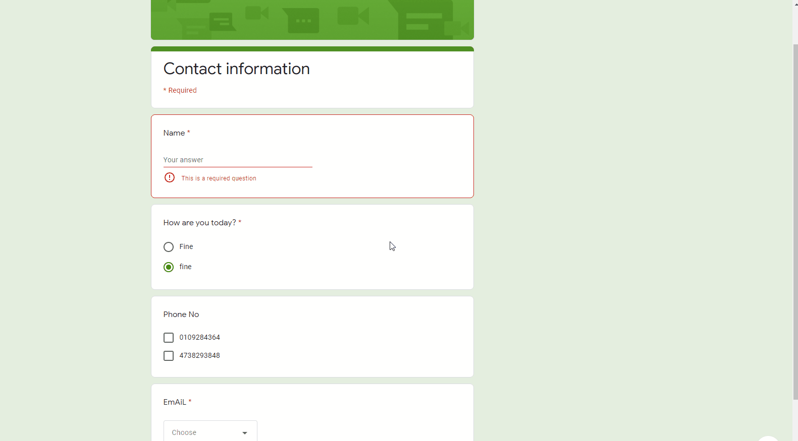
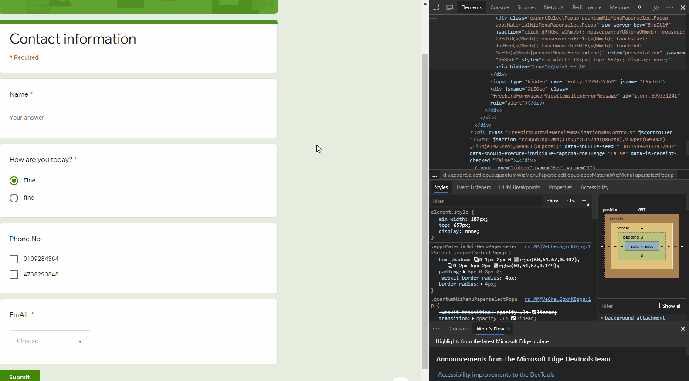
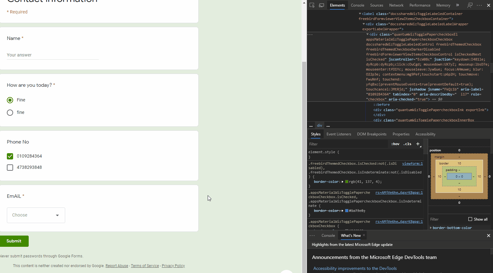

# AutoForm


[](https://www.python.org/)

This python script utilises Selenium to find elements in a form, fill them up accordingly and submit the form.<br/>
Tested with Google Form.

## Table of Contents
* [Setup](#setup)
* [Configuring the script](#configuring-the-script)
  - [Input Box](#eg1-input-box)
  - [Radio Button](#eg2-radio-button)
  - [Check Box](#eg3-check-box)
  - [Drop Down](#eg4-drop-down)
  - [Submit Button](#eg5-submit-button)
* [Submitting](#Submitting)

## Setup
Requests must be installed.
```bash
pip install requests
```

Selenium must be installed.
```bash
pip install selenium
```
Selenium requires a driver to interface with the chosen browser. Hence, drivers need to be installed in order for Selenium to function properly. As drivers vary for different browsers, they can be downloaded here: <br/>
| Browsers | Link to webdriver |
|---------|---------|
|Chrome|https://sites.google.com/a/chromium.org/chromedriver/downloads|
|Edge (New and Legacy)|https://developer.microsoft.com/en-us/microsoft-edge/tools/webdriver/|
|Firefox|https://github.com/mozilla/geckodriver/releases|

Ideally, the driver should be put in your PATH. If not, you can just manually link Selenium to wherever your driver is:
```bash
browser = webdriver.Edge('C:/Users/name/Downloads/msedgedriver.exe')
```
Run script
```bash
python AutoForm.py
```


## Configuring the script
The variables in this script must be configured first to match that of your form.

### Eg.1 Input Box
To enter an input create a variable in the script with your desired input in quotes ' ':
```bash
name = 'Name goes here.'
```
Copy the xPath of the input box from the form using Inspect Element as shown below:

Paste the xPath into the script:
```bash
#xPaths of the form's components
input_Name = '//*[@id="mG61Hd"]/div/div/div[2]/div[1]/div/div[2]/div/div[1]/div/div[1]/input'
```

### Eg.2 Radio Button
Select the option listed on the radio buttons first, then copy the xPath of your chosen option as shown below:

Paste its xPath into the script. (same as Eg.1)

### Eg.3 Check Box
Basically the same procedure as the Radio Button. Copy and Paste.


### Eg.4 Drop Down 
Now this is a bit more complicated than the first 3 as there is 2 seperate parts.<br/>
Firstly, copy the xPath of the 'Choose' button then paste it into the script (Same as above):

Secondly, copy the xPath of your desired option and then paste it into the script by creating a new variable:


### Eg.5 Submit Button
Basically the same as those above, Copy and Paste:


## Submitting
Hooray! After this last step, your script is completed!

### Input Box
Enter this into the script:
```bash
# Find the element/component via its xPath and automatically enter your input
browser.find_element_by_xpath(input_Name).send_keys(name)
```
### Radio Button/Check Box/Drop Down/Submit Button
You should be using the .click() function instead of .send_keys():
```bash
browser.find_element_by_xpath(RadioBut).click()
```

