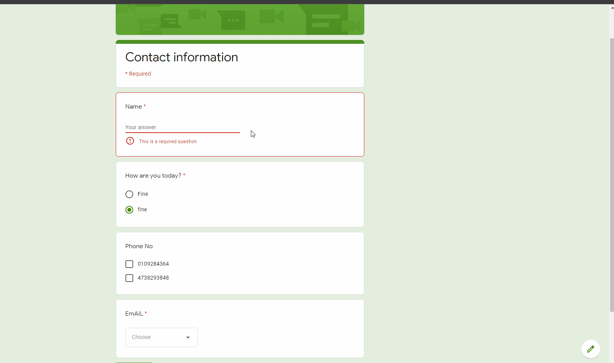

# AutoForm


[](https://www.python.org/)

This python script utilises Selenium to find elements in a form, fill them up accordingly and submit the form.<br/>
Tested with Google Form.

## Table of Contents
* [Setup](#setup)
* [Configuring the script](#configuring-the-script)

### Setup
Requests must be installed.
```bash
pip install requests
```

Selenium must be installed.
```bash
pip install selenium
```

Run script
```bash
python AutoForm.py
```

### Configuring the script
The variables in this script must be configured first to match that of your form.

#### Eg.1 Input Box
To enter an input create a variable in the script with your desired input in quotes ' '.<br/>
Copy the xPath of the input box from the form using Inspect Element as shown below:

Paste the xPath into the script:
```bash
#xPaths of the form's components
input_Name = '//*[@id="mG61Hd"]/div/div/div[2]/div[1]/div/div[2]/div/div[1]/div/div[1]/input'
```
